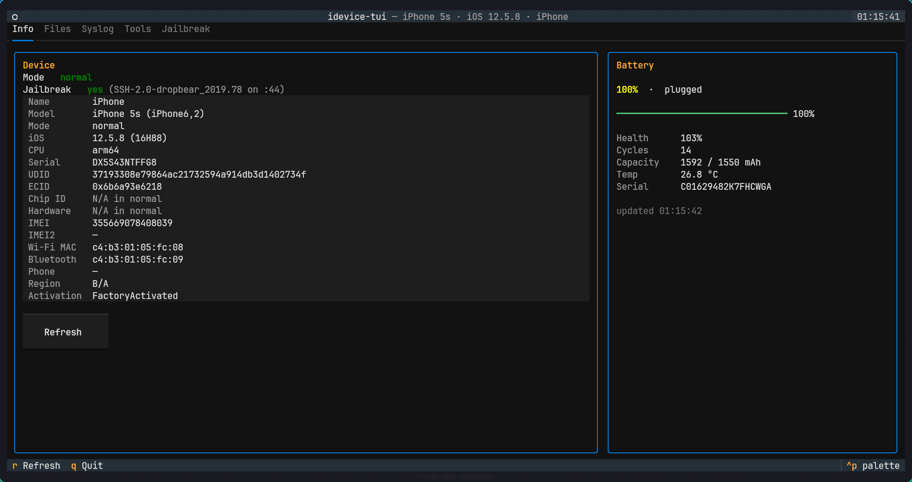
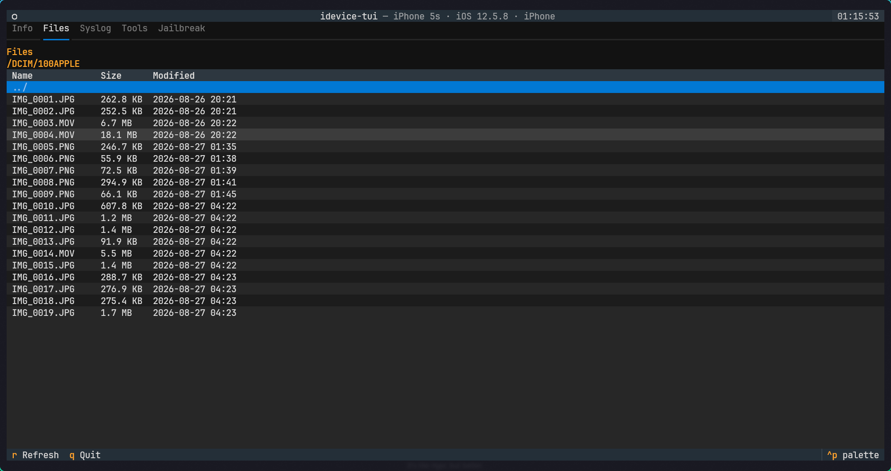
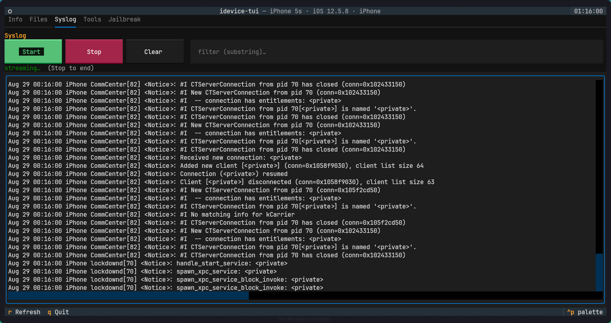
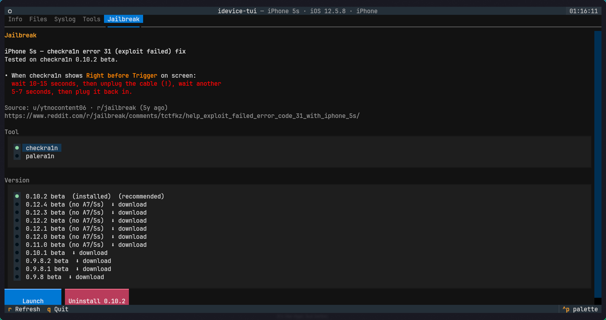

# idevice-tui

A Textual TUI for managing iOS devices from Linux. It provides a unified
device view, AFC file browsing, live syslog, safe hand-offs to Legacy iOS Kit,
and jailbreak tool launchers.

## Features

### Info

Device identity, battery state and jailbreak detection in normal, recovery and
DFU modes.



### Files

Browse AFC storage, preview text and download files to a per-device folder.



### Syslog

View and filter a live device log.



### Tools

Run Legacy iOS Kit for restore, downgrade, SHSH, jailbreak and DFU/recovery
workflows.

### Jailbreak

Choose and download supported checkra1n or palera1n versions, then launch or
uninstall the selected binary.



Device reads, Files and Syslog pause while a jailbreak tool owns USB, then
resume automatically when its window closes.

## Third-party tools and credits

`idevice-tui` is an independent UI and does **not** include, own, modify, or
redistribute the jailbreak binaries and external tools below. Their names,
trademarks, source code, release assets, licenses, device support and usage
terms belong to their respective maintainers. Please read each upstream project
before using it.

- [Legacy iOS Kit — LukeZGD](https://github.com/LukeZGD/Legacy-iOS-Kit): invoked
  as a separately installed external tool from the **Tools** tab.
- [checkra1n](https://checkra.in/): its official Linux CLI binaries can be
  downloaded from the publisher's URLs in the **Jailbreak** tab.
- [palera1n — palera1n team](https://github.com/palera1n/palera1n): its official
  GitHub release assets can be downloaded from the **Jailbreak** tab.
- [pymobiledevice3](https://github.com/doronz88/pymobiledevice3) and
  [Textual](https://github.com/Textualize/textual): Python libraries used by
  this application; see `pyproject.toml` for the exact runtime dependencies.

## Quick start

Requirements: Linux, Python 3.12+, [uv](https://docs.astral.sh/uv/), a USB cable,
and an unlocked/trusted iOS device.

```bash
uv tool install git+https://github.com/Pulladium/idevice-tui.git
idevice-tui
```

For a checkout from source, use:

```bash
git clone git@github.com:Pulladium/idevice-tui.git
cd idevice-tui
uv sync
uv run idevice-tui
```

`uv run idevice-tui` runs the command from the cloned source tree and its local
virtual environment. After `uv tool install`, the command is installed globally
and starts directly as `idevice-tui`.

To use the current checkout as the global development installation:

```bash
uv tool install --editable .
idevice-tui
```

## iPhone 5s

Choose a tool and version in the **Jailbreak** tab, then use **Download** or
**Launch**. On an iPhone 5s (`iPhone6,1` / `iPhone6,2`), use the checkra1n
version marked `(recommended)`.

Downloaded binaries are stored in `~/jailbreak-tools/` by default. Override the
directory in `~/.config/idevice-tui/config.toml`:

```toml
[jailbreak]
checkra1n_dir = "/path/to/jailbreak-tools"
```

Supported terminal emulators: kitty, foot, alacritty and xterm. On Hyprland the
required floating 120×40 window rule is configured automatically. See the
on-screen status messages for troubleshooting and mode-specific details.

## Compatibility and contributions

Hardware testing is currently limited to an **iPhone 5s Global (`iPhone6,2`)**
running on **Arch Linux with Hyprland**. This project may work on other
devices, Linux distributions, desktop environments and terminal
emulators, but they are not yet verified configurations. Do not treat the
current device list as a broad compatibility guarantee.

Forks and pull requests are welcome. In particular, reports and patches for a
different iPhone/iPad are extremely valuable. A contribution is easiest to
review and merge when it includes:

- device identifier (for example, `iPhone10,6`) and iOS/iPadOS version;
- Linux distribution, desktop/window manager and terminal emulator;
- concise reproduction steps and sanitized logs or screenshots for a bug;
- a focused test when the behavior can be reproduced without hardware.

Well-tested new functionality, device-specific fixes and reproducible bug
reports can be merged into the main repository after review. Please keep
third-party jailbreak binaries and private device identifiers out of commits.
